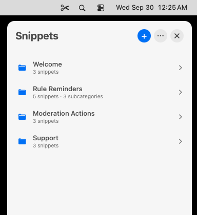
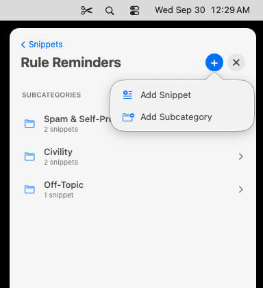
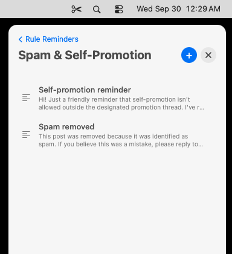

# Snippet Menu

**Your saved replies, one click away on your Mac.**

Snippet Menu keeps the replies you write over and over (welcome messages, rule reminders, warnings) in a tidy panel in your menu bar. Click one and it's copied, ready to paste anywhere.

- **Organized your way:** categories, subcategories and snippets.
- **Always at hand:** click the ✂︎ scissors in the menu bar, or press **Control + Option + S** in any app.
- **Private:** your snippets stay on your Mac. Snippet Menu never reads or saves anything else you copy.
- **Free:** no account, no subscription.

Requires macOS 13 Ventura or later. Works on Apple Silicon and Intel Macs.

  
  
  

---

## Download

**[Download Snippet Menu](https://github.com/2819-dev/Work-Universe/releases/latest/download/Snippet-Menu.zip)**

---

## Install

1. Open your **Downloads** folder and double-click **Snippet-Menu.zip**. A **Snippet Menu** folder appears.
2. Drag the **Snippet Menu** app into your **Applications** folder.
3. Open **Applications** and double-click **Snippet Menu**.

### The first time you open it

Snippet Menu is distributed independently rather than through the App Store, so macOS asks you to confirm the first time you open it:

1. When macOS says it can't verify **Snippet Menu**, click **Done**.
2. Open **System Settings** and choose **Privacy & Security**.
3. Scroll down to **Security** and click **Open Anyway** next to "Snippet Menu was blocked".
4. Confirm with your password or Touch ID, then click **Open Anyway**.

You only need to do this once. From then on, Snippet Menu opens like any other app.

When it opens, a **✂︎ scissors** icon appears in your menu bar and your snippets panel slides in from the right, ready for your first category.

---

## Using Snippet Menu

### Copy a snippet

1. Click the **✂︎** in the menu bar. Your snippets panel opens on the right side of the screen.
2. Click a **category** to open it.
3. Click a **snippet**. It's copied, and you'll see **"Copied: [snippet name]"**.
4. Click where you want the text and press **⌘ Command + V** to paste.

### Quick access from any app

Press **Control + Option + S** and a menu opens right at your pointer. Choose a category, then a snippet, and it's copied. This is the fastest way to grab a snippet while you're typing a reply.

### Add a category

In the main panel, click the blue **+** button at the top, type a name, and click **Create**.

### Add a snippet or subcategory

1. Open a category.
2. Hover over (or click) the blue **+** button at the top. Two choices appear:
   - **Add Snippet**: give it a title (the name you'll see in the list) and the text you want copied, then click **Save**.
   - **Add Subcategory**: a folder inside the category for grouping related snippets.
3. Inside a subcategory, the **+** button adds a snippet straight away.

### Edit, rename or delete

- **Edit a snippet:** hover over it and click the ✎ pencil.
- **More options:** right-click any category, subcategory or snippet to **Rename**, **Edit** or **Delete** it.

### Close the panel

Click the **✕**, press **Esc**, or click the ✂︎ again. It also closes on its own when you click into another app.

---

## Settings

Click the **•••** button at the top of the main panel.

| Setting | What it does |
|---|---|
| **Keyboard Shortcut…** | Change the quick-access shortcut. Click **Change Shortcut** and press the keys you want, for example **⌘ Command + Shift + M**. |
| **Open at Login** | Start Snippet Menu automatically when you turn on your Mac. Recommended. |
| **Show Library in Finder** | Shows the file where your snippets are saved, so you can back it up. |
| **Check for Updates…** | Checks whether a newer version of Snippet Menu is available. |
| **Quit Snippet Menu** | Closes Snippet Menu. To reopen it, open it from Applications. |

**Tip:** right-click the ✂︎ in the menu bar for the quick menu.

---

## Updating

Snippet Menu keeps itself up to date. When a new version is available, the bottom of the snippets panel shows **Update available**. Click **Update**, and Snippet Menu downloads the new version, installs it and reopens by itself within a few seconds.

To check at any time, click **•••** → **Check for Updates…**

Your snippets are saved separately from the app, so updating never affects them.

---

## Troubleshooting

**I don't see the ✂︎ in my menu bar.**
The menu bar may be full, especially on MacBooks with a camera notch, where macOS hides icons that don't fit. Quit another menu bar app to make room. The keyboard shortcut always works.

**"Open Anyway" isn't showing in Privacy & Security.**
It only appears for a short while after you try to open the app. Double-click **Snippet Menu** in Applications again, then return to **Privacy & Security**.

**The keyboard shortcut doesn't do anything.**
Another app may be using the same combination. Choose a different one under **••• → Keyboard Shortcut…**

**"Open at Login" won't turn on.**
Open **System Settings → General → Login Items**, click **+** under "Open at Login", and choose **Snippet Menu**.

**Update couldn't be installed.**
Snippet Menu can only update itself when it's in your **Applications** folder. Move it there and try again, or click **Open Download Page** and install the new version by hand (see **Install** above).

**My snippets are missing.**
If the panel says your library couldn't be found, it was moved or deleted. Restore it from a backup to the location shown by **Show Library in Finder**, or click **Create New Library** to start fresh.

---

## Uninstall

1. Click **•••** → **Quit Snippet Menu**.
2. Drag **Snippet Menu** from **Applications** to the **Trash**.
3. Optional: to also delete your snippets, click **Go → Go to Folder…** in Finder, enter `~/Library/Application Support/Snippet Menu`, and move that folder to the Trash.
